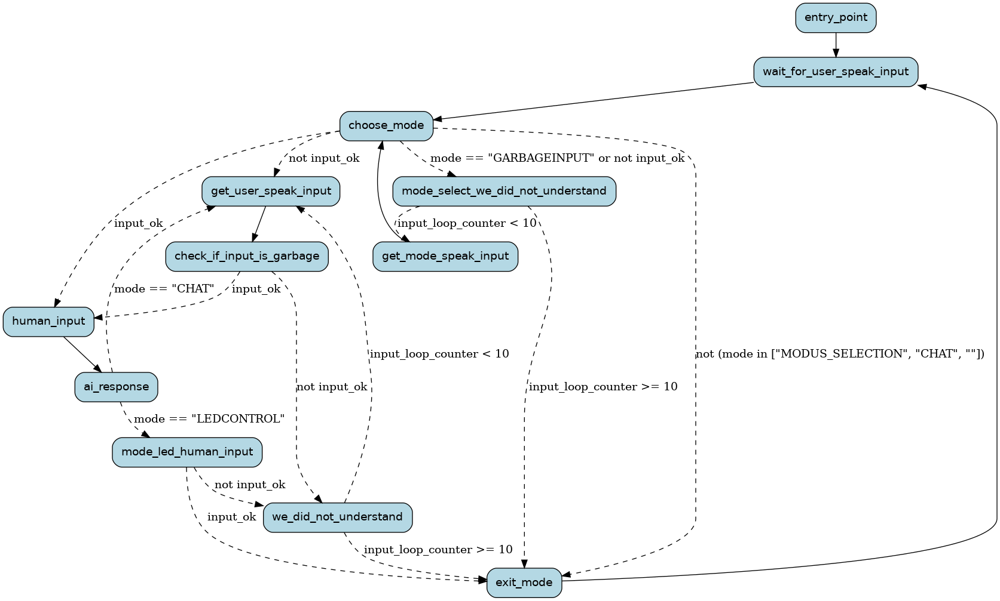

# local-servant-llm

Toy project to make tests with LLMs, tts, stt and graph based processing. Goal is to build an application that get user input from microphone and answers with a spoken response.

The main idea is:

* run all components as docker-compose ensembles and access them via API (LLM, TTS, STT).
* use burr library to define application as a graph.
* use german as the main language

The application graph looks like this:


## Folders with -stack in their name

Each folder with `-stack` in their name contains a component that can be started using docker compose. For ease of 
use the script `stacks.sh` can be used to start and stop them.

```
# Show status
./stacks.sh
# Start stacks
./stacks.sh start
# Stop stacks
./stacks.sh stop
```

The script automatically checks if nvidia/cuda is available. If so the `docker-compose-cuda.yaml` files are used (NVIDIA container). Else the cpu stacks in `docker-compose.yaml` are used. 

To force the usage of cuda stacks you can also run:

```
./stacks.sh start
```

## The application

* First create a venv and install dependencies
  
  ```
  python3 -mvenv venv
  source venv/bin/activate
  pip3 install -r requirements.txt
  ```

* Then run application (default configuration is used then, see below)
  
  ```
  python3 main.py
  ```
  
  ## Configuration

The application uses ENV variables to configure all aspects of the application.
When running local use a `.env` file, else set them as host environment variables.

| variable                | default                                        | possible values                          |
| ----------------------- |------------------------------------------------|------------------------------------------|
| TTS_ENDPOINT            | http://127.0.0.1:8001/v1                       | any http endpoint                        |
| TTS_PROVIDER            | openedai                                       | openedai, pyttsx, transformers           |
| STT_PROVIDER            | whisper                                        | whisper, speech-recognition              |
| STT_ENDPOINT            | http://127.0.0.1:8000/v1/audio/transcriptions  | url if remote service has been chosen    |
| WAKEWORD_PROVIDER       | speech-recognition                             | speech-recognition, open-wakeword        |
| WAKEWORD_THRESHOLD      | 250                                            | any positive integer                     |
| WAKEWORD                | computer                                       | any word or short phrase                 |
| AUDIO_PLAYBACK_DEVICE   | -1                                             | the device number, negative means "auto" |
| AUDIO_MICROPHONE_DEVICE | -1                                             | the device number, negative means "auto" |
| AUDIO_PYTHON_BACKEND    | pyaudio                                        | pyaudio, pyalsaaudio                     |
| LLM_PROVIDER            | ollama                                         | ollama                                   |
| LLM_ENDPOINT            | http://127.0.0.1:11434                         | any http endpoint                        |
| LLM_PROVIDER_MODEL      | llama3.2:1b                                    | llama3.2:1b, llama3.2:3b                 |


* Create a `.env` config file from the given example and adjust as needed
  
  ```
  cp _env .env
  ```

If no `.env` is found and no environment variables are set then the defaults are used. You need to provide only the
settings you want to overwrite.

## PyTTSX

The pyttsx package can use multiple backends from the host linux system for text-to-speech synthesis. Consider 
to install the following:

```
apt install espeak ffmpeg libespeak1
# german voices that replace the mechanical one that espeak ships with
apt install mbrola mbrola-de1 mbrola-de2 mbrola-de3 mbrola-de4 mbrola-de5 mbrola-de6 mbrola-de7 mbrola-de8
```

You can list the available voices on your host system with:

```
import pyttsx3

engine = pyttsx3.init()
voices = engine.getProperty('voices')
for voice in voices:
    print(f"ID: {voice.id}")
    print(f"Name: {voice.name}")
    print(f"Languages: {voice.languages}")
    print("------")
```

## speech-recognition backend vosk

The SpeechRecognition package supports multiple online and offline backends. This project uses the VOSK offline
backend. First a model needs to be downloaded from https://alphacephei.com/vosk/models

* For a slim model use https://alphacephei.com/vosk/models/vosk-model-small-de-0.15.zip
* For a good balance use https://alphacephei.com/vosk/models/vosk-model-de-0.21.zip
* Best quality use https://alphacephei.com/vosk/models/vosk-model-de-tuda-0.6-900k.zip

Extract the ZIP in project root and rename the extracted filename to `model/` so VOSK is able to find it.

```
unzip vosk-model-de-0.21.zip 
mv vosk-model-de-0.21 model
```

## PyTorch and Transformers

When using `transformers` in `TTS_PROVIDER` these additional dependencies need to be installed:

```
pip3 install transformers==4.47.0
pip3 install torch==2.5.1 torchvision==0.20.1 torchaudio==2.5.1
```

## Docker environment with PyTorch 2.5.1 GPU support

There is a development docker to run the application in a pytorch enabled environment with GPU support. The `Dockerfile`
and `runDevDocker.sh` script can be used for this purpose. 

Build and run the dev docker and mount the project into the workdir:

```
./runDevDocker.sh
```

## Links / unfinished stuff

* https://github.com/matatonic/openedai-speech
* https://github.com/DigitalPhonetics/IMS-Toucan
* https://github.com/thorstenMueller/Thorsten-Voice